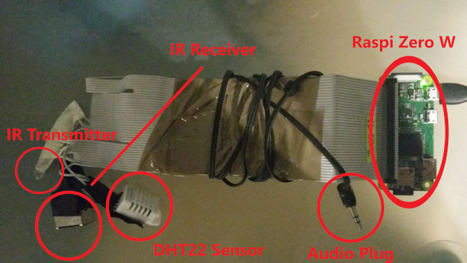

My Raspberry Pi Tools
=====================

Infrared Transmitter based on IR Slinger
----------------------------------------

I want to thank bschwind @github.com for his great code. Since I want to have a simple tool
box for my Raspberry Pi, I ripped all out of the repo which is not necessary for my intended usage.

My LED stripe is controlled with cron and changes brightness and colors depending on the time.

Temparature and Humidity sensor readout tool based on the pigpio library
------------------------------------------------------------------------

I want to thank http://abyz.me.uk/rpi/pigpio for his great pigpio library and his great example
source code. As with the Infrared Transmitter, I ripped out all parts of the reference code which
is not needed for my DHT22 sensor I own.

Installation
------------

To install the tools in the Raspberry Pi system, simply call `sudo ./install.sh`. Please be
aware that this script overwrites any existing cron tab entries!

TODO
----

The following tasks have to be done to setup my Pi which is not yet supported in the install script:
- in /etc/dhcpcd.conf change **slaac hwaddr**
- to support the native resolution of a 4:3 format projector, in Pi-configuration change **Underscan** to **Disabled**
- support TvHeadend installation and configuration
- do not use user pi but create a different one (note that 'pi' is hard coded below!)
- check if config.ini is present in the pi home directory

- support wireless socket, codes received by sniffer (git clone --recursive https://github.com/ninjablocks/433Utils.git):
  - OFF1: 7721987
  - ON1:  7721996
  - OFF2: 7697411
  - ON2:  7697420
  - OFF3: 7691267
  - ON3:  7691276

